# Stzh·video agent assistant

**One workspace for creative briefs, AI conversations and production tracking.**

[简体中文](README.zh-CN.md) · **Version 1.40** · [Release and acceptance notes](docs/releases/v1.40.en.md)

Stzh brings prompts, reference files, model connections, project memory, roles and results together for short-video and AIGC creators. **Web phase four is at its closing stage; accepted local work has been released.** External integrations, real media generation and mobile phase five remain incomplete. This is not an acceptance claim for every production workflow.

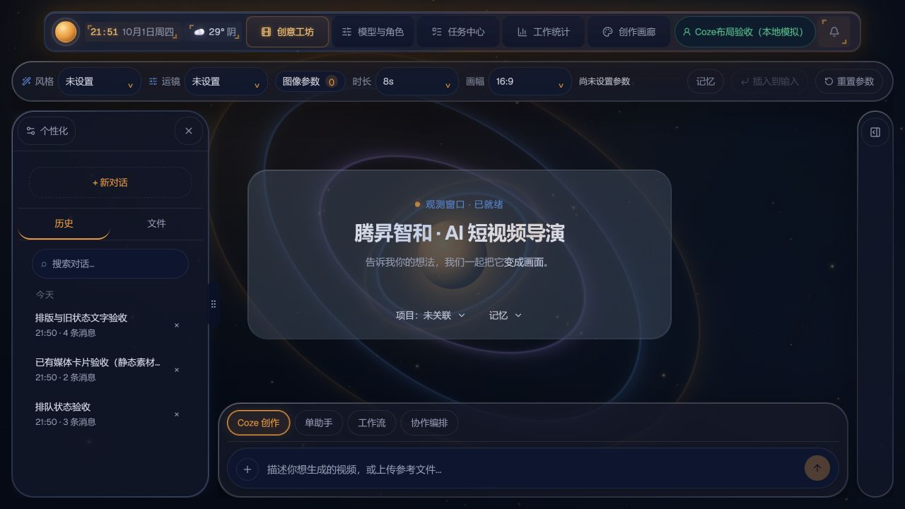

## Features: what you can do

- **Coze creation:** choose style, camera movement, duration and aspect ratio; attach references, associate projects and memory, track server tasks, restore history, retry and export. The observation card expands into a conversation supporting Markdown, code, tables and media results.
- **Single assistant:** discuss ideas and refine prompts with your own model connection; retain history, summaries and drafts, inspect request context and export Markdown.
- **Workflows and research:** creative, optimization, research and script chains with step results and recovery records. Style research starts with a plan for confirmation; a separate workbench retains sources, execution and reports. Project plugins can contribute tools and workflows.
- **Role collaboration:** select a project, role team and economy/standard/deep budget; discuss and review a brief, edit the final instruction and hand it to Coze. Role cards contain prompts, capabilities, default models and enabled states; runs retain history.
- **Model and role center:** presets for MiMo, DeepSeek, OpenAI, Anthropic, Qwen, SiliconFlow, OpenRouter and custom services; separate website/API URLs, model discovery and selection, output/context limits, save and cancel. Secrets are encrypted server-side; connections are account-scoped. A website URL is not a model-list API.
- **Memory and context:** project notes, user/project memories, enabled states, temporary exclusions and request inspection across account, project and session boundaries. Default `shadow` mode observes context; it does not imply enforced injection. Check the configured rollout mode.
- **Tasks, notifications and devices:** queued/running/paused/completed/failed states, filters, pause/cancel/requeue, WebSocket updates and polling reconciliation, plus phone pairing. APIs exist; the complete mobile experience is not accepted yet.
- **Statistics and gallery:** daily/weekly/monthly successful-media trends and activity calendar; image/video filtering, existing result preview and download. Text-only tasks do not count as media; old playback depends on source URL availability.
- **Plugins:** discovery, source installation, permissions, account library, project activation and recovery diagnostics. System-trusted registrations and account packages are distinct; third-party integrations require their own configuration and checks.
- **Appearance:** themes, wallpapers, liquid glass, orbit rings with a mouse-responsive galaxy, adjustable border glow, rounded switches and consistent typography. Reduced motion/transparency and keyboard focus recovery are supported. 1.40 adds silver title highlights, in-place expansion and state glow.

## Feature screenshots

Current Web screens using local fixtures, static assets or guest/empty states: **these are not generated video or live model results**. Expand each group to see all screenshots. [Capture scope](docs/releases/images/v1.40/features/README.md).

<details open>
<summary>Creation: Coze, assistant, workflows, research and collaboration</summary>

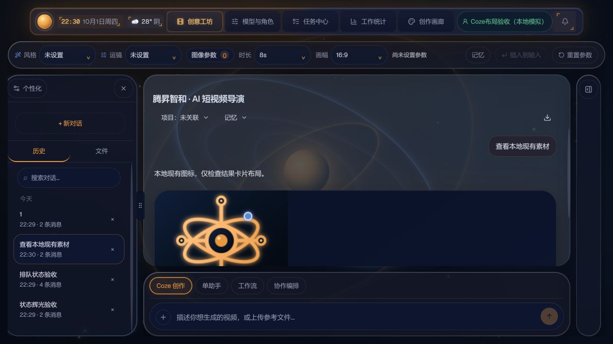
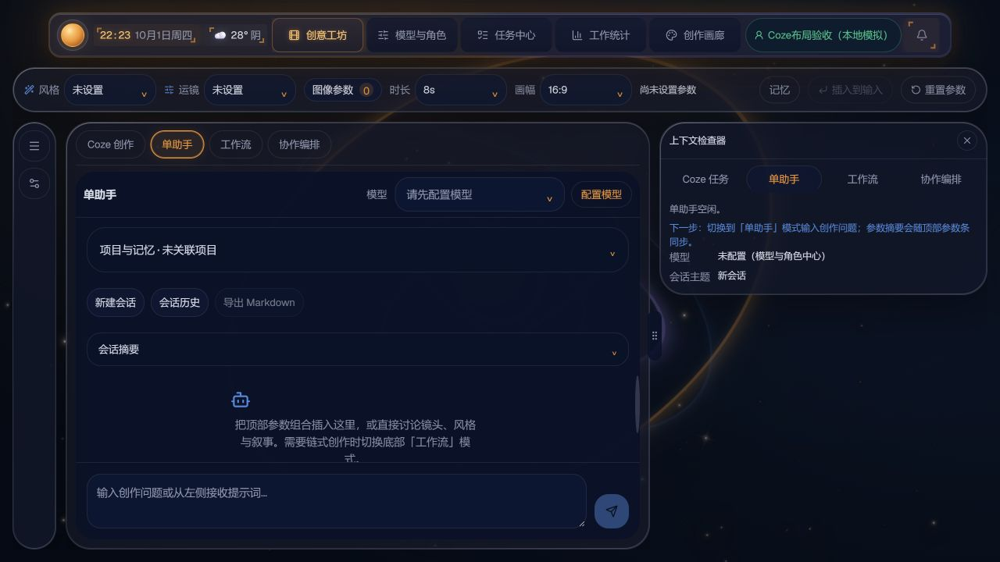
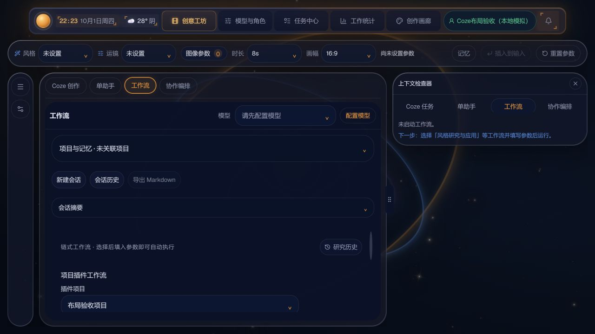
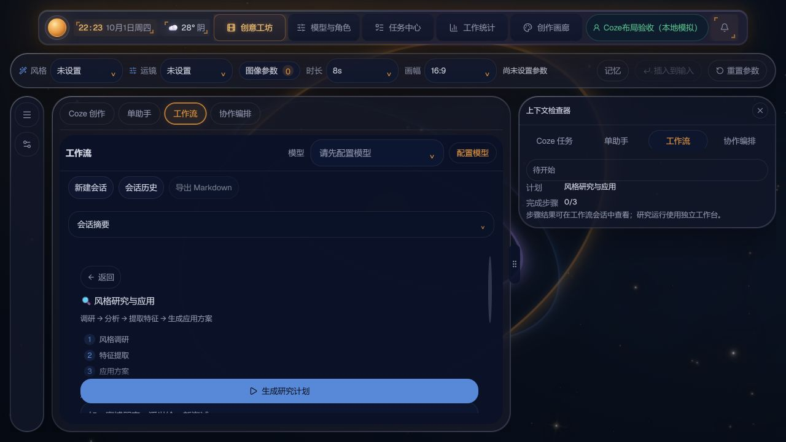
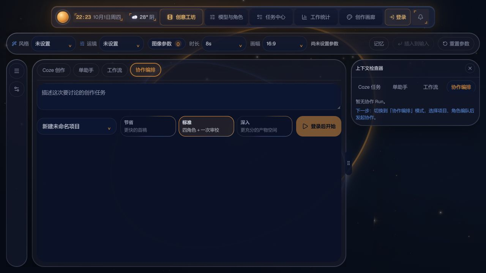

</details>
<details>
<summary>Management: models, roles, plugins, memory and account</summary>

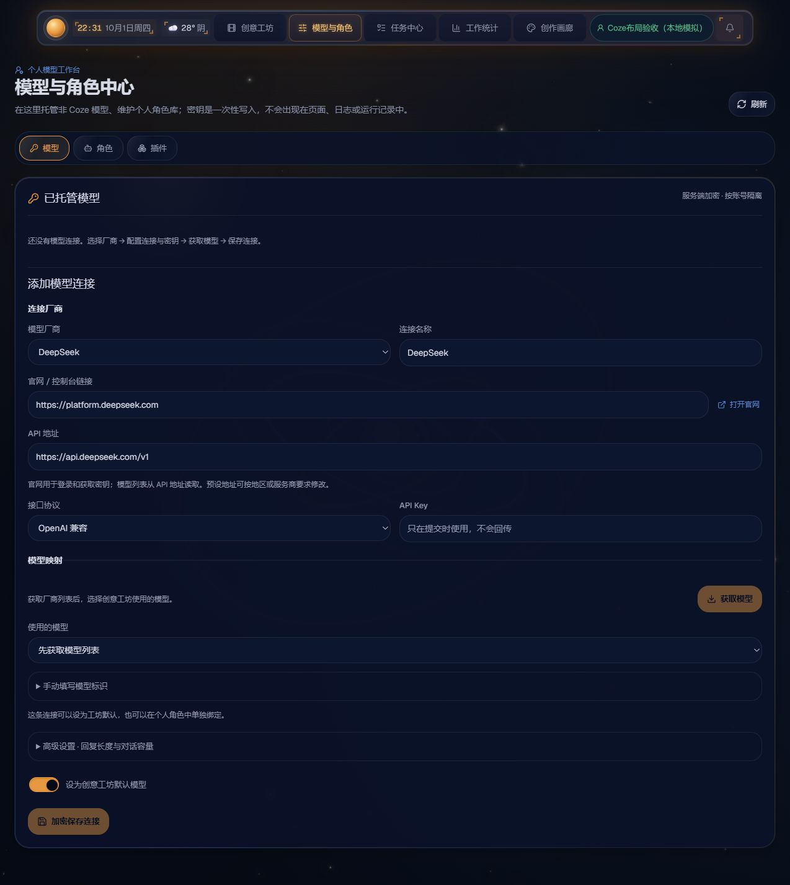
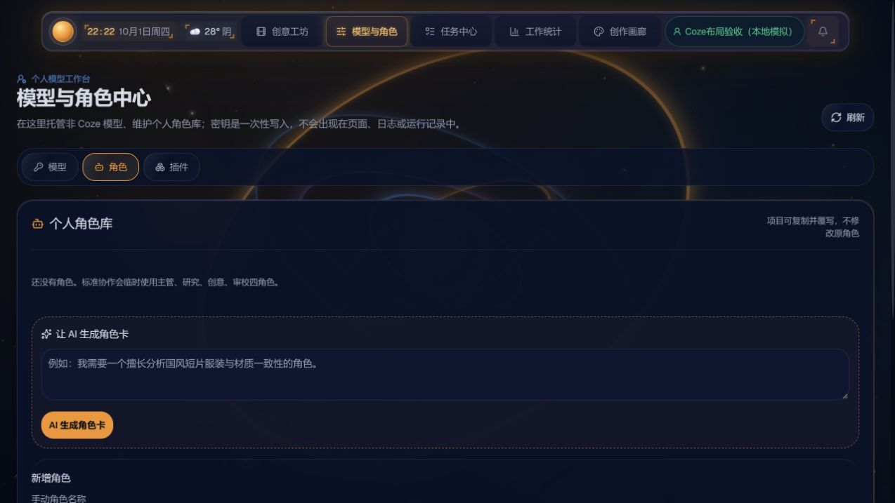
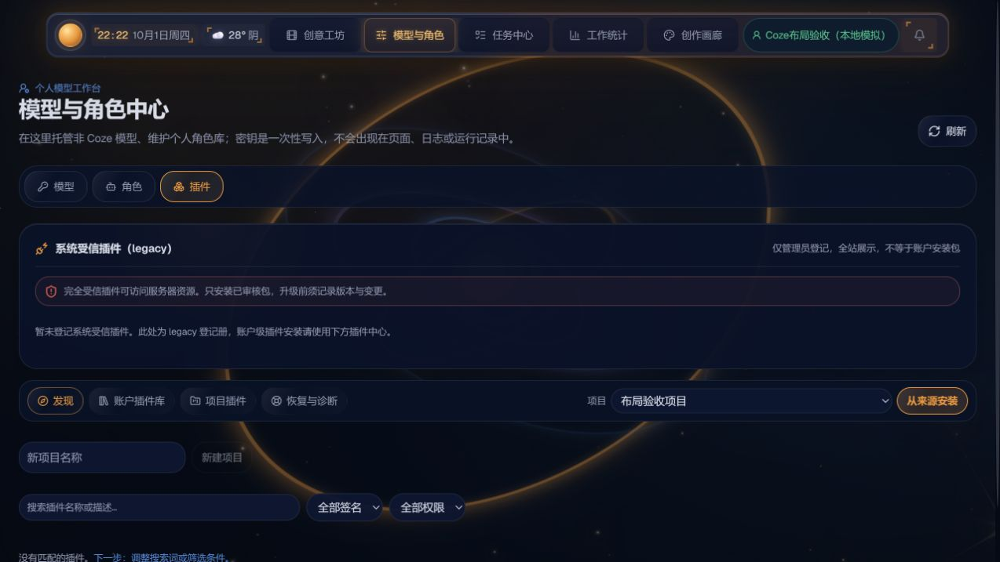
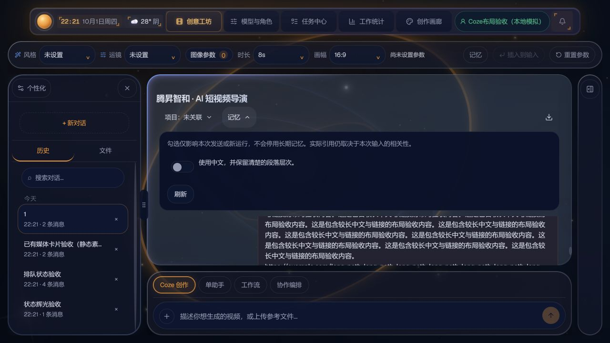
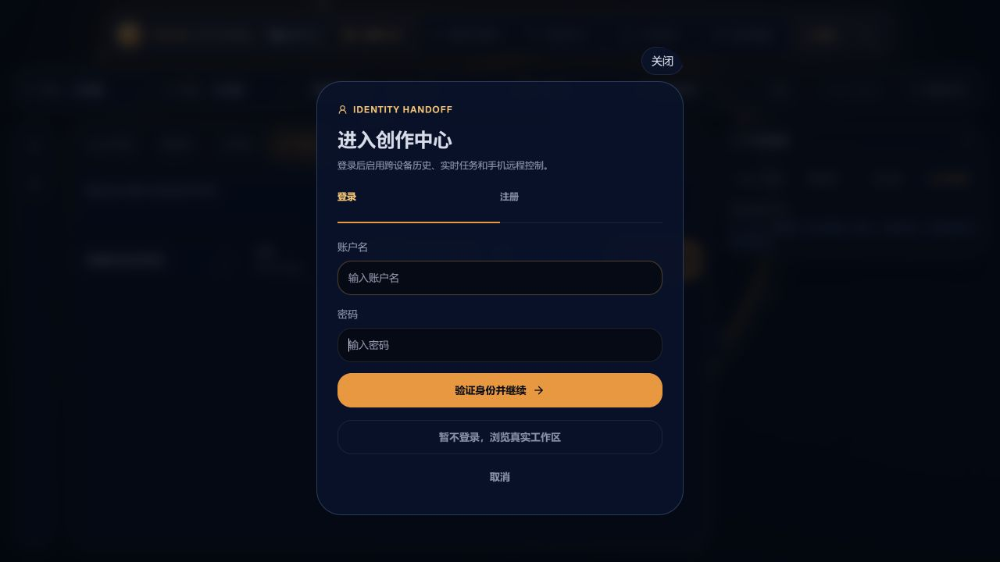

</details>
<details>
<summary>Results and appearance: tasks, statistics, gallery, themes, galaxy and glow</summary>

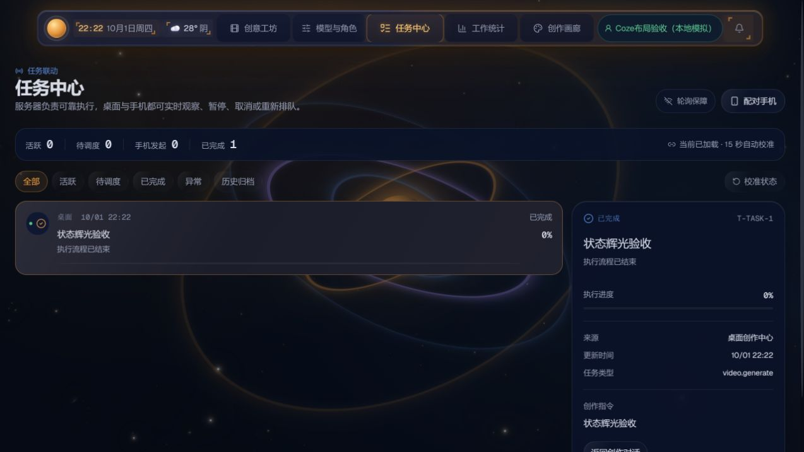
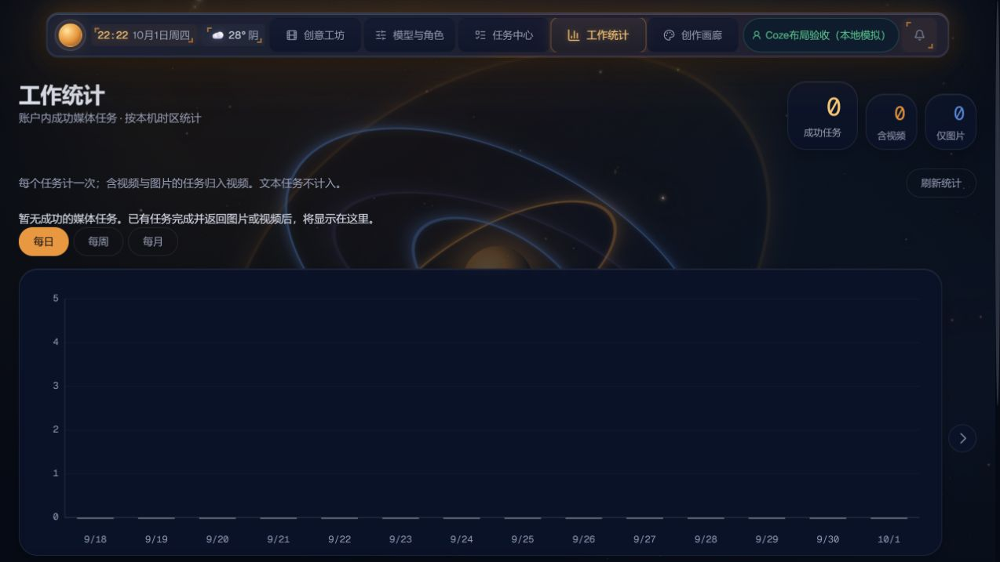
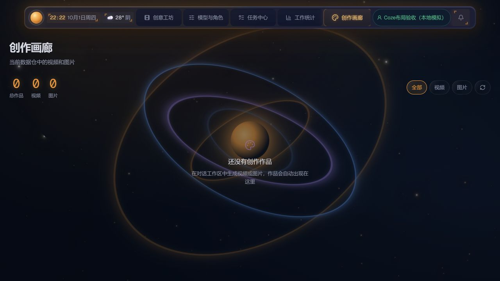
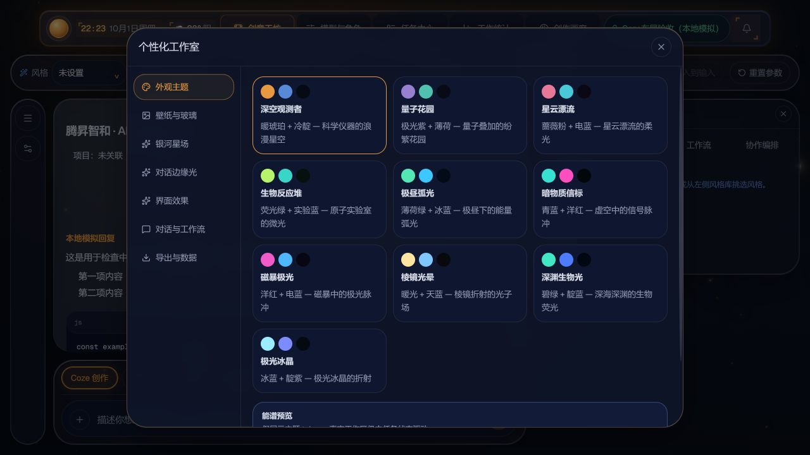
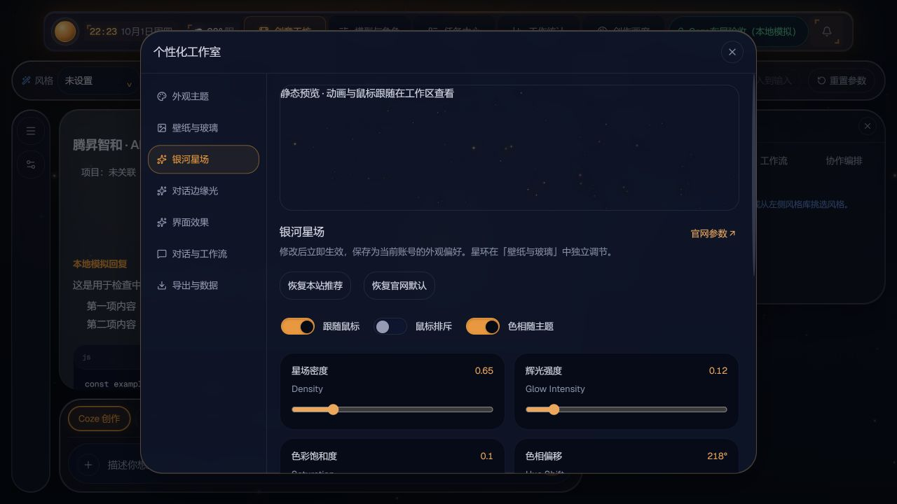
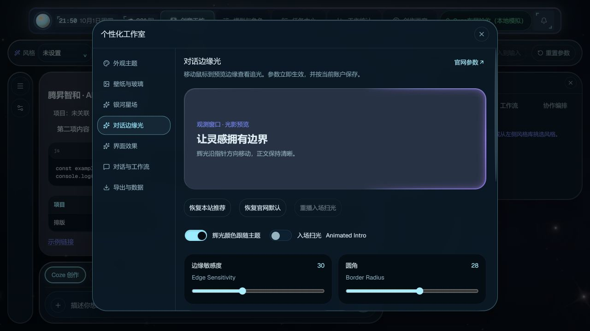

</details>

## Stack and integration flow

```text
Web / Electron / Expo clients
 → Express API + JWT → SQLite, attachments, task executor, WebSocket
 → model adapters / LangGraph collaboration / research runtime / project plugins
 → Coze Bot & workflows / OpenAI-compatible or Anthropic models / optional Python RAG
 → text, storyboards, prompts, media URLs → conversation, tasks, statistics, gallery, export
```

| Layer | Technology and purpose |
|---|---|
| Web | Next.js **16.2.4** static export, React **19.2.4**, TypeScript, Tailwind CSS 4; React Aria Components and Lucide |
| Visuals / content | Motion, GSAP / @gsap/react; Three.js, React Three Fiber / Drei, OGL; react-markdown, remark-gfm, rehype-highlight / sanitize. React Bits / Aceternity are visual and attributed implementation references |
| Backend / security / data | Node.js, Express 5, CORS, dotenv; SQLite / better-sqlite3, JWT / jsonwebtoken, bcryptjs, Node crypto AES-256-GCM; Multer uploads, ws realtime, Undici HTTP |
| Orchestration / plugins / export | @langchain/langgraph state graphs, custom TaskRuntime and research runtime, plugin subprocesses; AJV contracts, semver / tar / yauzl packages; docx, pptxgenjs / pptx-automizer, qrcode document and pairing capabilities |
| Downstream | Coze Bot / Workflow APIs, OpenAI-compatible and Anthropic Messages providers; research search/page-reading depends on configured adapters or plugins and their quotas |
| Optional RAG | Python, FastAPI / Uvicorn, ChromaDB, Sentence Transformers / BAAI bge-large-zh-v1.5; pandas, openpyxl, python-docx; retrieval, Wiki organization, configured MQE / HyDE |
| Desktop / mobile | Electron 35, electron-builder; Expo 56, React Native 0.85, Expo Router, AsyncStorage, WebView, camera/notification/gesture/safe-area components and Capacitor Android dependencies. Source availability is not installer or mobile acceptance |
| Development / checks | npm lockfiles, Node test runner, Playwright dependency, ESLint 9, TypeScript and Next builds; separate native-browser acceptance records |

All direct dependencies and exact versions: [Web](package.json), [server](server/package.json), [mobile](Tszh-App/package.json), [RAG](rag-service/requirements.txt) and lockfiles. `hello-agents-fms/` contains reference material; it is not needed to start Web.

## Clone, configure and run

Requires Git, **Node.js 22.18+** and npm; Python is only needed for RAG. SQLite is a native dependency: installation may require a matching Node/platform toolchain.

```bash
git clone https://github.com/fms211/Stzh-video-agent-assistant.git
cd Stzh-video-agent-assistant
npm ci
npm --prefix server ci
```

1. Create root `.env.local`:

```dotenv
NEXT_PUBLIC_AGENT_BACKEND_URL=http://localhost:8080
```

2. Run this command **twice** and place distinct values in `server/.env.local`. Both secrets require at least 32 characters. Keep them stable to preserve sessions and decrypt stored model keys.

```bash
node -e "console.log(require('node:crypto').randomBytes(32).toString('hex'))"
```

```dotenv
JWT_SECRET=first-generated-value
STZH_LLM_ENCRYPTION_KEY=second-generated-value
PORT=8080
# Only needed for real Coze execution; never put secrets in NEXT_PUBLIC variables
# COZE_API_TOKEN=your-token
# COZE_BOT_ID=your-published-bot-id
# COZE_BASE_URL=https://api.coze.cn
```

3. Start two terminals; open **http://localhost:3000**:

```bash
# Terminal 1
npm --prefix server start
# Terminal 2
npm run dev
```

4. Register and sign in → select provider/API/key in the model center → fetch and select model → save → choose workspace mode/project/parameters → submit → inspect tasks and gallery. Coze requires publication, permissions and quota; without a configured executor, queued tasks will not generate media. A fresh clone has no developer accounts or historical database.

**Static deployment:** `output: export` produces `out/`, served by Express. Do not use `npm start` (`next start`) for this export. Set root `.env.local` to `NEXT_PUBLIC_AGENT_BACKEND_URL=` (blank), remove any stale shell variable of that name, then:

```bash
npm run build
npm --prefix server start
```

Open **http://localhost:8080**. For separate hosts, set the reachable HTTPS API URL before building; public-variable changes require rebuilding. Default database: `server/stzh.db`; `STZH_DATA_DIR` selects another directory. Changing ports or fixture databases does not migrate accounts. 18080/18081 are developer preview ports, not clone defaults.

<details>
<summary>Optional: RAG, desktop and mobile source entry points</summary>

Adjust `KB_ROOT` and model-cache paths in `rag-service/ingest.py` and `retriever.py` to your machine: current source contains developer paths. Initial model downloads need network, storage and memory; real corpus and performance require separate acceptance.

```powershell
python -m venv .venv
# Windows; on macOS/Linux: source .venv/bin/activate
.\.venv\Scripts\Activate.ps1
python -m pip install -r rag-service/requirements.txt
npm run rag:ingest
npm run rag:start
```

RAG listens on 5000; set backend `STZH_RAG_URL=http://127.0.0.1:5000` when needed. Configure HyDE model URL/name/key through its environment variables.

```bash
# Build Web first as above
npm run electron:dev
# Windows: prepare the Electron-ABI SQLite binding before packaging
npm run electron:build
# Mobile source; phase five is not accepted
cd Tszh-App
npm ci
npm start
```

Electron needs `server/native/electron-v<ABI>/` bindings, not the Node SQLite binary. Expo devices need a reachable backend and device permissions. These optional installation flows were not validated in this documentation update.

</details>

## Development status, regression, smoke and remaining work

**As of 2026-10-01:** 1.40 Web UI and core business source are delivered; external integrations, cross-device verification and production deployment remain. Completion is stated by acceptance scope rather than a single percentage.

| Check | Actual result |
|---|---|
| Build | Production build passed; same-origin preview updated |
| Frontend regression | Release snapshot **518/518 passed** after fixing seven initial test-double/outdated-assertion failures |
| Backend regression | Workspace **315/315 passed**; initial release snapshot 314/315, then **two related checks passed** after removing a local-binary assumption from the Electron entry check. No claim of another full snapshot run after that fix |
| Concentrated smoke | Real Express + fresh isolated DB: **26 passed**; page entries and account/API checks, generation executor disabled |
| UI / visual | Five pages, four modes, drafts, history, project/memory, Escape focus, model form and glow controls; 1440/960/390 DOM boundaries, three themes, reduced motion/transparency passed |
| State / statistics | Locally simulated queue/run/pause/failure/retry-success passed; chart width stable for 33 seconds. Simulation is not real Coze/video acceptance |

Reproduce code checks with `npm run build` and `npm run test:p0` (frontend then backend); backend only: `npm --prefix server test`. Read-only smoke `scripts/stage4-readonly-smoke.cjs` needs a separately prepared isolated preview plus `STZH_SMOKE_BASE`, `STZH_SMOKE_USER`, `STZH_SMOKE_PASSWORD`; it does not create the environment. [UI evidence](docs/releases/evidence/v1.40/browser-smoke.json), [API evidence](docs/releases/evidence/v1.40/api-smoke.json), [full acceptance notes](docs/releases/v1.40.en.md). This README update checks documents, links and captures; it does not rerun business regression.

- **Pending integrations:** real provider model lists, production Coze permissions/quota, StylePromptMaster and LinkReader tools; authentication, rate limits and network security blocks prevent an all-passed claim.
- **Pending media:** real image/video generation, paid-media end-to-end calls and historical-video playback; no such APIs were called for this update.
- **Pending device checks:** physical touch, 200% text-only scaling, real IME confirmation and glow after actual provider verification.
- **Pending delivery:** mobile phase five, a new Electron installer, production deployment acceptance, portable RAG paths and real-corpus checks. Research/plugins require per-service acceptance; local UI checks do not validate every third-party workflow.

## Source map and licensing

`app/` Web · `server/` API/tasks/plugins · `shared/` contracts/context · `rag-service/` retrieval · `electron/` desktop · `Tszh-App/` mobile · `test/` and `server/test/` regression · `docs/releases/` evidence.

[Memory API](docs/knowledge/studio-memory-api.md) · [1.40 changes and rollback](更新md/2026-10-01-15-Web1.40视觉交互与发布.md). Older usage documents may predate the current implementation; use this README and source for startup. Third-party notices: `public/licenses/`, `docs/third-party-notices/`. There is no project-wide root license; unrestricted redistribution of all source should not be assumed.
