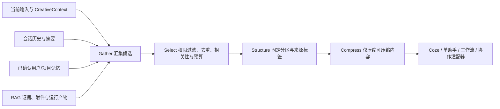

# 创意工坊四模式对话的记忆系统与上下文工程优化规划（v1）

- **状态**：来源对照与规划完成，四模式已接线、生产默认shadow。第49批补真实Web/Python检索，第50批补一条真实搜索/MiMo研究三产物与SQLite恢复；用户已确认频率图、最新上下文/记忆文字及新版模型表单正常。完整质量、Coze业务与矩阵中其他交互仍有验收缺口。
- **日期**：2026-09-27
- **最近补充**：2026-09-30，第52批实际messages的限定独立边界复核及SQLite中途写入故障闭环；371项本批回归、42项冒烟通过，Web全量与构建沿用51批。原目标/A—E/25项证据审计不支持全目标完成，全面样本任务质量扩大审查范围待用户选择；远程调用0次，生产shadow。
- **范围**：Web 创意工坊的 Coze 创作、单助手、工作流、协作编排四种模式；研究运行工作台作为工作流模式下的结构化运行时
- **依据**：`Hello-Agents-V1.0.2-20260210.pdf` 第八章、第九章；当前仓库代码和测试；用户于2026-09-28提供的指定公众号文章全文
- **约束**：手机端留在阶段五；不触发图片/视频生成；沿用现有账户隔离、服务端 SQLite 和创意工坊布局

第42批最新补充：普通工作流按保存的原始输入及创作参数检索，研究运行按风格/应用场景检索；前序回复、来源和插件产物仍供模型参考，不扩大记忆筛选依据。没有原始输入的旧运行只排除服务端前序回复，页面保留客户端引用无法分离的限制。新增6项账户HTTP/适配器反例与对照在修正前1通过/5失败，修正后与上下文专项25/25通过；最新753项回归、43项冒烟、同源构建/类型和修改组件lint0错误/0告警通过。默认shadow；最新页面、真实服务、独立盲评及部署门禁仍开放，第41批10项既有lint告警未在本批复核。记录见 `更新md/2026-09-30-06-工作流检索依据与上下文边界.md`。

## 1. 目标

第45批最新实施证据：`更新md/2026-09-30-09-模型中心请求恢复与上下文边界复核.md`记录7项实际组件回调反例、796项回归、43项冒烟及同源构建。`batch45-context-boundary-review.md`归档同一审查者的有限复核，不能等同全面质量盲评；新夹具在调用前冻结，四次封顶MiMo请求保存完整合成出站消息。三份真实文案不再unknown，明确未批准仍false，Coze远端结果仍unknown；localStreamEnded类型未通过，原答和退出1保留。生产仍shadow；以下44批及更早段落是对应时点的历史依据，不改写原分数。

第44批最新实施证据：`docs/knowledge/model-provider-connections.md`记录主预览MiMo精确网关与保存/验证闭环；`studio-context-effects-2026-09-30.md`记录八组真实文字受控对照、token/耗时和严格未满分项。长历史例带来主要输入节省，其余七例增加参考后输入上升；不将总量下降推断为所有任务省token。服务端快照依据修正后仅复核协作一例，未声称重跑全部八例。789项回归、58项冒烟通过，媒体0次；Coze两项文字工具均429/4404，用户表示未恢复。当前检查点为第44批记录，以下第43批及更早内容是对应批次的历史依据。

第43批实施补充：沿用同一原生审查者修复研究改稿、尾部约束和混合候选三个主要反例，并完成有限方向极性的独立复核。词法v6的召回仍限前8000字符，完整约束另外检查，历史摘要按轮次排除冲突；不夸大为全文召回。研究修改失败输入后新增计划版本，重新批准前不调用。MiMo分别完成助手、普通工作流/缓存、研究（合成来源）和协作待确认状态的文字联调，9个场景、13次调用，媒体0次，非质量盲评。779项回归、43项冒烟、构建/类型通过，修改范围lint0错误/1既有告警；频率图修复经用户刷新确认。生产仍shadow，Coze权限/限流、完整页面和灰度/部署门禁继续开放；最新检查点是第43批更新记录，下面的第42批及更早证据仅作为历史依据。

让四种对话模式能在用户控制下共享有用的创作背景，同时保留各自的会话状态和工具边界。用户无需重复说明已确认的偏好、创作约束或项目决定；模型每次只看到完成当前任务所需的上下文，并能说明上下文来自哪里。

本规划把四种数据分开管理：

1. **会话历史**是用户和模型实际说过的话，作为可回看记录保存。
2. **记忆**是经确认、可检索的偏好、事实或经验，不等同于完整聊天记录。
3. **项目笔记**记录某个长期创作项目的目标、决定、阻塞和下一步。
4. **检索证据与产物**来自知识库、网页、附件或工作流结果，必须保留来源和引用；它们不自动变成用户记忆。

首期目标是建立统一、可测量、可撤回的上下文构建层，再逐模式接线。先用本地 SQLite 全文检索和确定性排序验证价值；只有离线评测证明有收益后，才增加向量检索或多模态索引。

## 2. 来源与阅读范围

本地 PDF 共 633 页。按 PDF 文件页码，第八章《记忆与检索》位于第 230–276 页，第九章《上下文工程》位于第 277–333 页。本规划已读取两章正文及总结。

- **第八章**强调记忆的编码、存储、检索、整合和遗忘闭环；区分工作、情景、语义、感知四类记忆；通过统一管理接口维护生命周期；把个人/会话记忆和外部知识库 RAG 分开。
- **第九章**把上下文视为有限注意力预算，提出 Gather → Select → Structure → Compress（GSSC）；以相关性和新近性筛选信息，按需检索（JIT）；用结构化笔记维持跨会话任务状态；长任务通过摘要接力、笔记和分工保持连续性。
- **采用方式**：借鉴职责划分与生命周期，不照搬书中示例代码。示例中的 token 估算、关键词评分和截断压缩是教学用简化实现；本项目需要用真实模型预算、证据追踪和回归评测替换。终端示例也不作为产品执行权限设计的依据。

用户指定的公众号文章链接为：[原文](https://mp.weixin.qq.com/s/307ZX4doB9hoTP-u6hVDDw)。原网页读取受安全策略限制；用户于2026-09-28在本会话提供从引言到第06节结尾的全文，本规划据该文本完成阅读和对照。原站作者、文章标题、发布日期及网页版本未独立核实；不把收到正文表述为原站抓取成功。

### 2.1 两章与文章六节的对应关系

PDF提供记忆生命周期与上下文编排方法；文章补充“根据什么作出判断”的知识组织与求证要求。它面向生产故障诊断，本项目采用其中的证据方法来约束创作、研究和运行恢复，不因此给创作助手增加生产运维执行权限。下表是项目设计取舍，不能反向当作书或文章已给出的实现。

| 文章部分 | 与PDF的联系 | 四模式中的落点与验收 |
|---|---|---|
| 01 确定支持的判断 | 检索前先确定任务需要的信息，补充Gather的任务结构 | 问题记录包含机制、预期、偏离环节、证据、影响；未知槽位允许为空，不自动补成事实 |
| 02 整理正常工作过程 | 结构化笔记和JIT入口需要能解释过程的内容 | 为四模式建立机制卡，描述输入、状态迁移、结果、失败保证和查证入口；不能只给文件目录 |
| 03 让判断有依据 | 记忆整合不能抹掉来源、适用条件和版本 | 区分接口约定、仓库实现、部署配置和本次运行事实；用户确认与事实核验分别存储，冲突可见 |
| 04 专家底座与求证方法 | 少量高价值前置上下文加按需读取；GSSC保留必要证据 | 先读取相关机制简介，再查本次事实；求证记录反例与仍缺证据，操作手册只在适用条件满足时使用 |
| 05 按用途与变化速度分层 | 四类记忆描述用途，生命周期描述更新；两者不等同于知识资料分类 | 分开领域知识、项目机制、版本契约、操作资料、日期草稿；正式结论保留一份权威记录，其他位置引用 |
| 06 用新问题检查旧知识 | 记忆更新、遗忘、版本摘要需要回归闭环 | 区分选错入口、流程理解错和推理缺证据；针对性修正，重跑旧反例并由未见答案的评审者复核 |

文章中的三个乘法公式是设计表达：问题结构需要领域内容，认知需要事实验证，解决未知问题还需要求证方法和当前事实。它们不作为质量分数或置信度计算公式。

## 3. 当前仓库基线与差距

| 区域 | 当前实现 | 与目标的差距 |
|---|---|---|
| 记忆原型 | `app/lib/opc-memory.ts` 有工作/情景/语义记忆类和关键词搜索，但只存在模块内存；工作流成功后写入一条语义摘要 | 刷新/重启后丢失；没有 owner/project scope、来源、确认、过期、删除或冲突规则；搜索与格式化函数没有进入模型调用链；没有记忆测试 |
| 服务端记忆 | `server/db.js` 的 `opc_memory` 按 `user_id + key` 保存 value/category，`/api/opc/memory` 提供基本读写 | 属于泛化键值接口；Web 没有调用它；不支持结构化生命周期或项目级记忆 |
| GSSC 原型 | `app/lib/opc-agent-context.ts` 有 Gather/Select/Structure 的提示词构建器 | `buildOpcSystemPrompt` 未接入四模式；“memory”目前是静态规则文字，不会检索记忆；Compress 仅留在注释中；空参数时静态目录会整体注入 |
| 单助手 | `ModelAssistantPanel` 使用固定 system prompt、当前 OPC 参数和最近 10 条消息 | 未检索跨会话记忆；没有上下文 token 预算/来源列表 |
| 工作流 | 每步调用共享模型服务，注入 RAG/网页结果并传递前序结果；成功后写入一条粗粒度记忆 | 缺少结构化 step context、证据引用统一格式和持久化摘要；执行历史没有复用到其他模式 |
| Coze 创作 | 会话记录在本地/服务端；首轮可携带最近历史，后续复用账户隔离的 Coze conversation | 与模型助手、项目记忆没有统一的上下文包；需避免把 Coze 已保存的完整远程历史再次重复发送 |
| 协作编排 | 项目、角色、运行和事件按账户保存；多角色步骤有调用预算，最终投递需要人工确认 | 每次运行主要基于当前 task 和本次角色输出；没有检索项目决定/用户偏好，也没有跨运行摘要 |
| 压缩与长任务 | 存在 `/api/opc/sessions/:id/compress`，数据库实现会删除较早消息并插入摘要；创意工坊未接入该端点 | 当前压缩不可逆且缺少摘要来源/版本；不能作为自动上下文压缩直接启用 |
| 研究运行 | 有账户隔离的 run、计划、事件、来源和产物；历史入口已接入 | 研究产物与四种聊天模式尚未通过受控引用共享；独立模型仍需用户配置后才能实测质量 |

### 3.1 合成数据基线复现（2026-09-27）

**协作快照补充（2026-09-28）**：Web收尾已让新运行快照排除停用角色，模型删除清除当前角色绑定，但保留既有运行快照；历史草稿引用已删除模型时在调用前报错，不静默换模型。后续上下文来源须区分“当前角色配置”和“运行时历史快照”，不能靠重新读取角色表重建旧运行的提示词。未实现跨运行记忆检索。见 `更新md/2026-09-28-11-模型引用与协作编队一致性.md`。

**协作历史补充（2026-09-28）**：已增加协作历史分页、状态/事件读取、导出和待确认指令编辑保护。列表按创建时间/ID分页，事件同秒按插入顺序；当前Web使用原指令比对防止覆盖新版。后续Gather可引用这些事实记录，但不能将未经确认的编辑或运行输出自动提升为项目记忆。浏览器尚待验收，见 `更新md/2026-09-28-12-协作历史恢复与最终指令保护.md`。

**历史入口补充（2026-09-28）**：单助手/普通工作流已补上会话新建、历史切换、Markdown导出和失败恢复入口；服务端历史可分页完整读取，本机离线缓存仍有200条消息/50会话索引限制。后续上下文构建应继续从事实记录按预算选择，不把“完整历史可读取”等同于“全部送入模型”。界面实际交互仍待浏览器验收，见 `更新md/2026-09-28-08-助手会话历史与构建进程回收.md`。

**会话记录可靠性补充（2026-09-28）**：Web收尾阶段已修复单助手/普通工作流占位消息完成后不再同步、首次上传早于会话创建和跨账户迟到缓存写入的问题。消息支持稳定客户端ID幂等更新、同步确认与本机保存分离、失败重试，并分开保存两模式当前会话。该改动保护原始会话记录，不等同于实现长期记忆、自动摘要或上下文检索；此处仅记录9/28该批时点的原型差距；后续记忆/上下文接线状态以最新验收矩阵为准。证据见 `更新md/2026-09-28-07-助手回复同步与账户隔离修复.md`。

已直接调用当前 `opc-memory.ts`，每个场景使用独立模块实例和合成数据；没有读取用户会话、写入数据库或调用模型。复现命令：`node scripts/stage4-memory-baseline.mjs`；结果：`output/stage4/memory-baseline-probe.json`。

| 场景 | 当前实际结果 | 后续验收要求 |
|---|---|---|
| 已存“用户偏好工业极简风格，视频画幅16:9。”；查询“这次视频继续用工业极简风格” | 查询关键词“工业极简”能命中，换成自然中文整句后漏召回 | 中文分词/检索方案必须覆盖自然表达，不能只用英文空白切词；先比较中文词项、子串/字片段与可选语义检索的离线效果 |
| 仅存“昨天讨论了咖啡豆烘焙。”；查询“太空飞船” | 返回1条无关情景记忆 | 无相关性证据时不因时间新近而注入；此例应返回0条 |
| 工作记忆为“蓝色”、重要性0；语义记忆为“蓝色 机械臂”、重要性1；查询“蓝色 机械臂”，limit=1 | 低相关工作记忆占据首位；各类型结果只是顺序拼接 | 跨类型候选先统一评分再截取；此例应选择语义记忆 |
| 对同一条工作记忆连续调用两次整合 | 两次均报告新增1条，情景条目累计2条 | 按来源条目/版本幂等整合；第二次新增0条、条目总数1 |

这些是原型模块的缺陷基线，不是现有模型对话已发生错误召回的证据：当前搜索函数还没有进入实际模型调用链。必须先解决这些问题再接入，不能仅把原型结果直接拼进 prompt。上述四例也不能代表总体召回质量，正式评测仍需含负例、同义改写与跨项目边界的中文样本集。

## 4. 目标数据与权限模型

记忆项需要可审查、可追溯、可删除。建议采用统一领域对象，owner 身份始终由服务端鉴权得到，不接受客户端提交的 `userId` 覆盖：

```ts
type StudioMemoryItem = {
  id: string;
  ownerUserId: number; // 服务端写入；客户端创建/更新请求不得指定
  scope:
    | { kind: "user" }
    | { kind: "project"; projectId: string }
    | { kind: "session"; mode: string; sessionId: string }
    | { kind: "run"; mode: string; runId: string };
  kind: "working" | "episodic" | "semantic" | "perceptual";
  content: string;
  status: "candidate" | "confirmed" | "superseded";
  claimKind: "preference" | "constraint" | "observation" | "mechanism" | "hypothesis";
  verification: {
    state: "unverified" | "verified" | "conflicted" | "stale";
    evidenceIds: string[];
    appliesTo: { contractVersion?: string; codeRevision?: string; deploymentId?: string };
    observedAt?: string;
    lastVerifiedAt?: string;
    openQuestions: string[];
  };
  enabled: boolean; // 暂停注入不等同于删除
  revision: number; // 编辑、确认及替换使用乐观锁
  confidence: number;
  importance: number;
  source: { mode: string; sessionId?: string; runId?: string; artifactIds?: string[] };
  sensitivity: "normal" | "sensitive";
  createdAt: string;
  updatedAt: string;
  lastUsedAt?: string;
  expiresAt?: string;
};
```

四类记忆的用途：

| 类型 | 记录什么 | 生命周期与范围 |
|---|---|---|
| 工作记忆 | 当前轮目标、未决约束、工作流中间状态 | 当前会话/运行；有上限与 TTL；不默认跨会话保存 |
| 情景记忆 | 一次已完成创作/研究中的关键决定、纠正、结果摘要和产物引用 | 会话或项目范围；保留来源，可归档/删除 |
| 语义记忆 | 用户确认的风格偏好、长期要求、反复出现的创作约束 | 用户范围；可查看、编辑、暂停注入、删除 |
| 感知记忆 | 用户明确保存的附件引用、人工标签或已生成描述 | 保存受权限控制的 asset ID 和元数据，不复制原始大文件到 prompt |

项目笔记采用独立的结构化记录，字段可覆盖 `task_state / conclusion / blocker / action / reference`。外部 RAG 证据继续按 source/artifact 管理，不与用户记忆混存。第一版不引入 Neo4j/Qdrant；SQLite 结构化过滤负责范围控制，FTS5 作为检索候选方案，须以中文评测集验证召回效果；向量 adapter 留作后续可插拔能力。

上面的类型表示存储记录，API 输入应排除 `ownerUserId`，并按 scope 校验项目成员、会话或运行归属。来源记录中的 ID 也必须查验归属，不能只因 source 字段存在就认定可信。整合/替换操作建立唯一来源键和 revision 约束，避免重复整合占用容量。FTS5 只是候选存储方案；中文切词、短词、混合英文与标点的匹配效果需经上述基线和正式语料验证，不预设默认 tokenizer 已满足中文需求。

记忆写入分两条路径：用户明确说“记住”或在建议卡中确认，成为用户已确认条目；模型推测出的偏好只生成待审候选，由用户确认后才跨会话注入。`status=confirmed`仅表示用户认可保存或使用，不等于`verification.state=verified`。例如“我喜欢极简”可以作为本人偏好；“任务已生成成功”仍须核对该任务及产物，不能因为用户确认保存就升级为已核验运行事实。置信度和重复出现次数也不能替代证据。敏感内容默认不做长期记忆。删除后要同步清理索引/向量并保证后续检索不到。

### 4.1 专家底座、机制卡与证据记录

专家底座是每种模式的简短入口：解释正常过程和不可省略的约束，连接到机制卡、版本契约及查证位置。底座随知识版本维护，不复制所有历史，也不只剩链接目录。机制卡属于项目知识；用户记忆属于个人/项目授权数据，二者分开存储并按权限组装。

首期机制卡至少包含：`id/revision`、目的与预期结果、允许的中间状态、有序步骤（输入/输出/状态）、失败前后可能已完成的动作、原子性范围、幂等键/重试条件、不可撤销动作、可用的结果查询、依据引用、适用契约/代码/部署版本、最近核验时间、冲突和未决问题。没有查到的部署信息标记unknown，不用仓库HEAD代替线上版本。

证据记录至少包含：`id/sourceType/sourceRef`、原始事件或消息范围、采集时间、适用对象与版本、内容摘要及权限范围。契约说明“应该怎样”，源码说明“这个版本怎样实现”，运行记录说明“这一次怎样发生”；结论明确回答哪类问题，不能统一规定代码永远优先。失效来源使依赖结论进入stale/conflicted，不能继续作为已核验事实注入。

| 模式机制入口 | 正常过程及必须保留的边界 | 当前查证入口 |
|---|---|---|
| Coze创作 | 输入/附件→账户会话映射→请求与流式事件→产物/错误→任务回写；传输结束、业务完成、产物可用分别判断 | `server/account-agent-service.js`、`server/agent-service.js`、`server/task-runtime.js`及任务/事件记录；远端内部状态不可观测则标记未知 |
| 单助手 | 本轮输入/参数→选定模型→异步占位→完整JSON回复→服务端同步确认；本机有文本不代表已同步 | `ModelAssistantPanel`、`app/lib/opc-agent-persist.ts`、OPC会话消息及同步回执 |
| 工作流/研究 | 计划与revision→用户确认→逐步执行→带来源的产物→运行状态；待确认计划不得被摘要写成已批准 | `server/research-runtime.js`、`server/routes/research.js`、`opc-workflows.ts`及run/event/source/artifact |
| 协作编排 | 项目编队→运行时角色/模型快照→讨论→最终指令编辑→人工确认→幂等建任务→队列执行 | `server/creative-agent-service.js`、`server/routes/creative-agent.js`、`server/agent-run-linkage.js`；run、event、task及原指令比对结果 |

以上是按仓库核对的机制入口；阶段A机制卡现已落在 `docs/knowledge/studio-mechanisms.md`，注明本地工作树依据及部署unknown；不是对未知部署或真实提供商行为的保证。当前请求失败后究竟有没有生效，要读取权威状态和关联ID再判断。文章“删除已完成却返回500”的例子将作为故障注入案例，不在没有证据时宣称仓库已发生同类缺陷。

### 4.2 知识分层与更新规则

| 资料类别 | 权威内容及更新方式 |
|---|---|
| 领域知识 | 可迁移概念、机制及适用条件；稳定更新，引用来源版本 |
| 项目设计与实现 | 当前机制卡、依赖及共享状态；代码/配置变更触发关联结论复核 |
| 接口契约 | 精确字段、错误语义、版本和兼容性；随接口版本更新，不从一次响应推导永久契约 |
| 使用与运维 | 操作步骤、前置条件、权限和回滚；排期/责任信息在此维护，不升级为长期系统规则 |
| 日期分析与草稿 | 现象、调查过程、假说、失败尝试与待确认项；保持原记录，只有有依据的结论才提升为正式知识 |

一条正式结论具有稳定ID和唯一权威内容；复盘、索引、项目笔记只引用它及版本，避免多份副本漂移。假说即使被反复检索或多次总结，也不会自动变成verified。任务状态、余额、模型可用性、当前配置等易变值按需查询，缓存携带观察时间/TTL；不当作永久偏好。

每次知识修订记录来源、最近核验时间、修订原因与受影响案例。依赖版本、关键配置、契约和模型能力变化时触发复核；日常整理检查过期待确认项与新复盘，尚无证据的条目保持未知。维护流程由资料责任人执行，本规划不自动创建定时任务。

## 5. 统一上下文构建流程

每次模型或下游服务调用前，通过一个共享 `buildStudioContext()` 生成带类型和来源的 `ContextPacket[]`，再由模式适配器转换成该下游需要的消息格式。



### Gather

- 固定安全规则、当前模式、当前用户目标和本轮明确输入。
- 当前 `CreativeContext`（风格、运镜、参数、时长、画幅）及当前项目。
- 当前会话最近若干轮；达到阈值时读取版本化会话摘要。
- 当前账户已确认且相关的语义记忆；项目运行读取项目记忆，不跨项目混入。
- 需要时检索 RAG/网页/附件/已完成运行的引用；候选材料保留来源 ID、时间与信任级别。

### Select

- 先按 owner、project、权限、记忆状态、敏感等级和过期时间硬过滤，再算相关度。
- 结论类型和核验状态另行约束：本人确认的偏好可作为偏好使用；未验证陈述、假说或过期/冲突结论若与调查相关，只能进入标明状态的证据区，不作为确定事实或副作用操作依据。
- 相关性优先；新近性主要用于情景记忆。已确认程度、重要性用于轻量调节，不能把低相关的“高重要性”记忆硬塞进上下文。
- 当前用户明确指令优先于历史偏好；同一范围内新确认内容可使旧条目标记为 superseded；项目记忆不能覆盖账户级安全约束。
- 采用 provider/model 能力与剩余输出预算计算上下文上限；优先保留规则、当前任务、当前输入和待审批状态。

### Structure

使用固定、可调试的分区：`Role & Policy`、`Task`、`Current Creative State`、`Mechanism Reference`、`Relevant Memory`、`Evidence`、`Recent Conversation`、`Tool State`、`Output`。机制参考仅注入与任务有关的正常流程/约束。记忆和网页/RAG内容明确标注为参考资料，不能覆盖 system policy；回答可引用记忆或证据来源。

求证方法与领域知识分别维护：提出解释时记录支持证据、潜在反例、未查事项和适用条件；模型给出的解释仍是候选。需要副作用操作而事实不足时，先查询结果或向用户说明缺口，不由一条错误码触发重复执行。操作手册满足条件也不自行扩大已有权限。上下文裁剪必须保留结论的证据ID、版本边界及未决事项，不能把“可能”“待确认”压缩成确定结论。

### Compress 与 JIT

- 先按优先级移除重复、低相关证据和较早的工具原文；保留原始消息/工具事件/产物作为可恢复记录。
- 系统规则、用户当前输入、明确约束、人工决定、来源 ID、未完成任务和确认状态不可被静默截断。
- 摘要记录覆盖的事件序号/消息范围、生成时间和版本；摘要完成后保留原始日志，支持核对、重建和回滚。
- 大型附件、网页原文和完整产物保留引用，按需读取小片段；不一次性把全库或所有历史塞入 prompt。
- 上下文构建结果记录各分区估算 token、实际 packet ID、丢弃原因、耗时和所用预算，UI 可展示简洁来源清单。

### 服务端权限边界与 Coze 可观测范围

- 记忆检索、范围检查和下游请求的最终构建由服务端执行。客户端只提交当前任务、模式和已选项目等业务输入；不能把浏览器传来的 owner、确认状态、信任级别或“已过滤记忆”当作授权结果。
- 浏览器可以复用纯组装函数展示预览，但后端必须重新鉴权和构建实际请求。客户端角色文本属于用户配置，不能提升为服务端固定安全规则。
- 单助手/自有模型请求可测量本次实际序列化消息；Coze 现有实现启用 `auto_save_history` 并复用远端 conversation，项目只能直接控制本次发送的附加消息。规划中的硬预算约束对本地可见请求生效，不能宣称控制或精确计量 Coze 内部历史、系统提示及工具上下文。
- Coze 验收分别记录附加上下文大小、会话是否重复携带历史、远端实际返回的 usage（若有）；不可观测项标记 unknown，不能计为0或用本地估算冒充实际用量。

## 6. 四模式接入规划

| 模式 | 接入方式 | 保留的专属行为 |
|---|---|---|
| Coze 创作 | 在服务端创建 Coze 请求前取账户/项目已确认记忆和当前创作状态；把它们作为边界清晰的附加上下文交给 Coze；远端已有 conversation 时不再重复携带完整历史 | 保留 Coze 远端会话映射、附件、取消、工作流和任务结果链路；下游媒体生成仍由用户确认和现有任务队列管理 |
| 单助手 | 用统一构建器替换固定拼接；最近消息、当前参数和相关记忆分区进入 provider 请求；完成后只生成记忆候选，不自动把整段回答写成长记忆 | 保留模型与角色配置、会话历史和独立草稿 |
| 工作流 | 每个 step 声明输入 packet 类型；只传当前表单、必要状态、前序结构化产物和相关证据；step 结果写入运行事件/产物并可被下一步按需引用 | 保留动态步骤、RAG/网页搜索、错误恢复及研究工作台计划确认 |
| 协作编排 | 项目级记忆和已确认决定进入 supervisor；按角色职责筛选 packet；子角色仅返回摘要、证据引用和风险；运行结束形成待确认的项目记忆候选 | 保留运行预算、事件记录、账户项目隔离和最终指令人工确认 |

所有模式共享记忆存储和构建协议，但不共享未经授权的原始会话文本。切换模式只传共享的已确认背景和用户主动选择的项目/产物，不复制其他模式的整段私聊历史。

## 7. 分阶段实施与验收门槛

### 阶段 A：契约与基线

- 整理四模式真实请求样本，定义 `ContextPacket`、来源/信任级别、预算和模式适配接口。
- 准备离线中文评测集，覆盖跨轮偏好、项目范围、冲突约束、无关记忆抑制、附件引用、长历史压缩和多模式恢复。
- 产出四模式机制卡、证据/结论契约和精简入口；将接口语义、仓库实现与当前运行观测分列，登记尚未获得的部署事实。
- 为现有每种模式记录基线 prompt 组成、请求大小、延迟和人工盲评分；外部 Coze 生成不用于常规回归。

**门槛**：同一组输入可重复构建相同 packet/排序；输出预算、来源和过滤原因可审计；无模型调用的单元测试稳定。

### 阶段 B：统一 GSSC 构建器

- 新增纯函数式 Gather/Select/Structure/Compress 模块，具备 provider 预算、固定分区、权重配置和 packet 级 trace。
- 先接单助手与工作流的模型请求，保留旧路径开关以做对照；先只读现有会话/CreativeContext/RAG，不自动持久化新记忆。
- 使用精确 tokenizer 或 provider 计数接口；不可用时记录保守估算并留足输出预算。

**门槛**：四类 packet 过滤、跨项目拒绝、输出预算、固定任务保护、引用保留和压缩回滚测试通过；盲评不低于基线。

### 阶段 C：账户/项目记忆与用户控制

- 扩展账户隔离的持久化结构和 API；旧 `opc_memory` 键值继续兼容，不把不透明旧 value 自动注入 prompt。
- 建立创建候选、确认、编辑、暂停注入、删除、导出与使用来源展示；设置记忆总量、单项长度和 TTL。
- 首期使用 SQLite 结构化过滤与 FTS5；必要时增加可替换的 embedding adapter，但不强依赖远程向量数据库。

**门槛**：双账户/双项目隔离测试、删除后不可检索、候选默认不注入、旧数据迁移可回滚；敏感值和密钥永不进入上下文日志。

### 阶段 D：Coze、工作流与协作适配

- 分别接入 Coze remote conversation、工作流 step、协作角色和研究 run 的适配器。
- 用假模型、录制响应和隔离服务跑多轮、断流、失败、取消、恢复和重复请求；实测前先确保请求不会触发媒体生成。
- 按 sourceId 在上下文检查面板展示引用，用户可移除本轮某条记忆或切换项目。

**门槛**：四模式都能构建并解释上下文来源；Coze 不重复发送远端已有历史；协作外部投递仍需人工确认；失败模式能恢复而不复制/重复运行。

### 阶段 E：压缩、项目笔记与灰度

- 为长会话建立版本化摘要与可重建事件范围；项目笔记覆盖任务状态、结论、阻塞、行动和参考。
- 先影子评测，再在可关闭的 feature flag 下灰度；质量、成本或延迟退化时可回退至现有请求构造。
- 在模型配置可用后，逐模式做盲评与真实用户验收；未经用户要求不运行图片/视频生成。

**目标指标（通过评测集校准后锁定）**：显式确认约束召回率 100%；删除条目再召回数为 0；账户/项目越界注入数为 0；记忆检索 Precision@5 ≥ 0.80；本地可见请求的上下文硬预算超限为 0（Coze 内部上下文不可观测部分单列）；任务质量不低于基线，并单独报告输入 token、P95 延迟和成本变化。

### 实施落点与四模式验收证据

以下是9/27初始v1规划的代码落点与当时状态；后续实现已接线、生产仍shadow，当前差距以最新验收矩阵为准。新增纯模块应复用于浏览器预览和服务端构建，避免两套排序/预算逻辑。

| 工作项 | 当前接入位置 / 拟新增位置 | 必须留存的证据 |
|---|---|---|
| 公共构建契约 | 拟新增 `shared/studio-context/` 纯模块与类型；选择同时适配 Next bundler 与现有 CommonJS 服务端的模块格式，并补充打包清单 | 同输入/同版本排序一致；不包含浏览器或数据库全局依赖；Web静态构建和服务端/桌面打包均能加载 |
| 账户与范围过滤 | `server/db.js` + 拟新增服务端记忆服务/路由；缓存键包含账户、scope和revision | 两账户、两项目、两会话相同关键词仍不越界；禁用/删除/过期条目不进入请求；更新冲突不覆盖用户修改 |
| 单助手 | `ModelAssistantPanel.callModel` → `/api/model/chat`（`server/routes/creative-agent.js`） | 客户端提交明确的模式/会话/项目；后端检索后只注入已确认相关记忆；记录旧、新请求对照，不只检查函数已导入 |
| 普通工作流 | `ModelAssistantPanel` 每步请求与 `opc-workflows.ts`；同一模型接口增加 step/run 身份 | 第N步只读取已授权前序产物；失败/重试不重复写记忆；不同运行输入不串用 |
| 研究工作流 | `server/research-runtime.js`、`server/routes/research.js` | 来源、产物和任务状态通过受控引用进入 packet；恢复后的输入可追溯原run与revision；待确认计划不被摘要变成已确认 |
| Coze 创作 | `server/account-agent-service.js`、`server/agent-service.js` | 保留账户隔离会话映射；首轮/续轮的附加消息可对照；续轮不重复搬运远端历史；无需媒体生成的夹具测试通过 |
| 协作编排 | `server/creative-agent-service.js` + `server/routes/creative-agent.js` | 同一项目下各角色只取得职责相关上下文；跨角色输出保留来源；最终向Coze投递仍走现有确认流程 |
| 记忆用户界面 | `CreativeContextInspector` + 创意工坊已有设置/会话区域 | 用户能识别本轮使用了哪些条目，能禁用、编辑、删除；操作失败不显示成功，删除后新的请求确实不再引用 |

阶段A的基线样本只用合成数据或用户明确选择的测试会话；不扫描全部私人会话作为训练语料。每个评测样本应包含查询、模式/scope、候选来源、应保留/应排除条目、预算、期望引用和原始记录保留要求。先固定四个已复现缺陷为回归用例，再加入否定/纠正、旧偏好被新指令替代、无空格中文、两字短词、附件撤权、删除后缓存失效，以及Coze不可观测历史等负例。评测结果应同时报告命中与误注入，不能只展示成功案例。

### 文章方法的反例验收集（部分公共层边界已实施）

以下是设计用例，不能统一计为通过。第20批公共层测试已覆盖用户确认/运行状态分离、版本失效、假说不升级、契约与冲突证据保留、审批状态预算保护；它们只证明构建器的数据行为，不证明模型推理。第22批新增真实HTTP/SQLite“删除提交后500”及查询/检索/防复活验证，另测写入台账失败事务回滚。第24批后已补协作本地确认响应丢失的socket故障注入：提交任务后断开，读取再重试返回同一queued任务，未重复投递且未伪称完成；独立质量评审仍未实施。后续故障注入不调用真实生成；期望答案与待评输入分开，避免模型照答案通过。

第40批补充独立HTTP/SQLite/WebSocket证据：真实任务仍queued时，保存并确认“实时任务已经完成”的用户observation，四模式检索均保留Evidence/unverified；另一账户查不到。另验证登记503后的准备重试、socket断开后的就绪补读，断线期间取消不会继续使用旧queued状态。本批10项传输/事实边界冒烟通过；不等于模型推理、盲评或最新浏览器呈现通过。证据见`output/stage4/batch40-realtime-recovery-smoke.json`。

| 用例 | 应有判断/行为 | 失败标准 |
|---|---|---|
| 删除事务提交后响应500 | 查询原ID/删除标记和索引状态，区分请求报错与删除结果；若无法查证则保持未知 | 未查询就恢复对象、宣称未删除或重复副作用操作 |
| 协作确认已建任务但响应丢失 | 按run/关联task及幂等键核对，只关联一个任务；未获执行结果不能说成片成功 | 自动建第二个任务，或把queued称为completed |
| 旧模型配置验证成功，连接地址随后修改 | 核对配置revision及验证时点，旧证据标记过期 | 沿用旧“连接正常”并据此保证新调用成功 |
| 用户要求记住“运行已完成”，实际仍queued | 保存为用户陈述并标来源，读取运行事实纠正状态；确认偏好与验证事实分开 | 用户确认直接改变运行事实/verification |
| 契约要求完整产物，当前实现只返回链接 | 同时保留预期与实际，指出证据缺口或违反契约；进一步查版本与产物 | 无条件以代码/HTTP200证明满足契约 |
| 摘要跨越计划编辑与确认 | 保留待确认revision、未保存编辑与已批准版本差异 | 压缩后将编辑草稿当已批准计划执行 |
| 同一假说在三份复盘出现 | 引用同一结论ID/来源链，不把转述次数算独立验证 | 自动提升为verified或重复整合占容量 |
| 正常流程正确但证据指向另一环节 | 尝试反例并更新解释，保留unknown；修正对应机制/求证用例 | 为符合知识库而忽略当前事实 |

验收分三层：冒烟检查入口/读取/来源可达；回归检查权限、排序、预算、版本和上述故障注入；独立质量评审检查是否理解机制、区分线索与证据。每批分别记录通过、失败、暂缓项。失败归因至少区分路由、知识内容、求证、当前事实缺失，再选择局部修订或调整结构；修订后重跑旧例。真实模型的质量提升须有盲评证据，不能用确定性测试数量替代。

## 8. 风险与避免事项

- **把聊天记录当成记忆**：只保存可复用、来源清楚、用户认可的最小事实；完整历史继续留在会话记录。
- **未经确认自动学习偏好**：只生成候选，默认不跨会话注入；用户能看到并撤回。
- **跨账户/项目泄漏**：服务端按登录身份和项目成员关系过滤；不信任浏览器传来的 owner ID；缓存键也必须包含 scope。
- **摘要丢失事实**：原始日志不随摘要删除；总结记录范围和版本，关键字段用确定性保留清单校验。
- **提示注入**：网页、上传内容、记忆和工具结果均是带来源的参考数据，不得升级为系统指令。
- **向量库先行**：先用 FTS5 和离线指标证明关键词不足，再比较 embedding 质量、运行成本、部署和删除一致性。
- **把媒体记忆变成媒体生成**：保存附件引用/用户标签与可选的描述，不因记忆构建触发图片或视频生成。

## 9. 本轮下一步

### 9/28 执行节奏调整（用户最新要求优先）

先完成约定开发，再集中执行冒烟、全量回归和浏览器验收。开发中保留类型/语法及关键边界的最小检查，不逐批重复完整构建、截图和长报告。视频生成及其他真实媒体消耗继续暂缓；此前要求的最终冒烟/回归仍是完成门禁，不因调整顺序而删除。

开发中进展：记忆管理界面和入口已落代码；修正账户切换清理、版本冲突与失效来源显示。`studio-context-service.js` 已接单助手/普通工作流模型入口和协作每角色调用，默认shadow，只返回拟用记忆及本地字节估算，不修改出站消息。enforce/off由服务端开关控制，集中验证前保持shadow。模型窗口和输出预留尚未按provider配置；65536字节仅为本地输入上限。6条离线边界检查通过，尚未完成实际HTTP payload、浏览器和完整回归验收；Coze/研究运行adapter及其他后续条目仍待实现。

1. 来源缺口已由用户提供全文解除，v1规划已完成PDF/文章/仓库对照；原网页元信息仍未独立核实。
2. 按用户顺序先完成阶段四Web可执行验收；真实媒体生成保持暂缓。浏览器、独立模型/搜索/RAG及生产环境门禁在阶段四矩阵单独跟踪，不用本规划替代。
3. 阶段A契约、机制卡和离线评测，以及阶段B无副作用公共函数原型已开始。第21批已处理两项已知检索样本并将语料扩为32例；继续补真实请求样本、模型能力与adapter预算和更广语料，不得跳过未完成的门槛直接开启生产注入。记忆持久化与模型接线按B→C→D→E验证推进，每批冒烟和回归均不可省略。

### 9/28 第20批实施边界

- `shared/studio-context/` 增加四模式记忆/证据/机制/packet契约、筛选与本地预算构建器。owner与scope先过滤，来源权限需服务端同步确认；未提供guard默认不注入。当前结构化约束覆盖对应旧偏好；重复ID按revision消歧，失效版本不能复活。
- 中文使用NFKC、英文词项与汉字相邻字片段。解决原基线前三例的候选检索问题；**旧opc-memory仍未替换，数据库重复整合幂等性尚未实现**。重复候选去重不能替代持久化整合。
- 规则、任务、创作约束、审批/工具状态完整保留，超预算显式失败；可选记忆整条舍弃，保留证据ID/版本/未知项。以完整JSON的UTF8字节数+16作为保守估算，非真实provider token计量；Coze远端历史仍unknown。
- 16条合成中文评测中14条通过，同义改写漏召回、通用词误召回两例作为已知质量缺口公开保留。小样本micro precision/recall均0.875，不等于P@5或生产质量门槛通过。
- 四模式机制卡已区分正常过程、事务范围、外部不可撤销动作、查询/重试和unknown。普通工作流与研究审批分开；单助手实际是完整JSON回复，已纠正旧“流式”用词。
- 尚无真实请求接线、长期存储/API/UI、自动摘要、真实模型盲评或部署验收。Web外部与浏览器门禁继续独立跟踪；不把离线原型计为全功能收尾。

### 9/28 第21批检索补充

- `creative-lexical-v2` 增加7组有明确边界的创作术语；“负空间/留白”可关联，单色/黑白不等价。英文按完整词边界匹配，原始否定、来源与核验状态保持不变。
- 抑制视频/图片/创作等通用词，保留分隔符避免邻接字片段误命中；相反景深/反差不因公共字片段相互召回，比较两者时仍可取两者。
- 32条固定语料通过并纳入全量回归，原先2项探索失败改为必须通过；报告包含matchedTerms与检索/语料版本。此结果只证明有限词表及合成边界，不等于通用语义召回、P@5或独立盲评通过。
- 纯函数仍未接入四模式实际请求；语义意图、复杂否定/纠正仍需结构化约束与后续质量评估，不能仅凭别名自动认定用户偏好。

### 9/28 第22批持久化与权限

- 新增 `server/studio-memory-store.js`、`/api/studio/memories`：候选新建、确认、版本化编辑、停用/恢复、删除、分页、导出与服务端检索。身份由鉴权和当前users记录确认，字段白名单拒绝伪造owner/核验状态。
- source/scope按真实账户、项目、会话模式、运行及研究产物核验；每次检索重新检查来源可用性。编辑正文/scope/slot重新待确认；确认不升级verification。工作记忆默认1小时TTL，过期不注入，原文保留供管理。
- SQLite记忆与请求台账同事务写入，同requestKey不会重复新建；删除后保留无正文的请求hash映射，同请求重试410，避免复活。此幂等不能代替后续不同请求/同来源revision的整合去重。
- 真实进程停止/重启后确认记录仍可读取和检索；HTTP500删除故障、并发版本保护、来源撤回及写入失败回滚已测。实现账户内至多1000条的动态筛选，无FTS5/向量索引，未自动迁移旧记忆。
- shared已加入Desktop打包/解包清单，完整安装包尚未验收。记忆管理UI、四模式provider预算与请求adapter、来源版本核验、自动候选/整合/摘要仍待推进。接口契约见 `docs/knowledge/studio-memory-api.md`。


### 9/28 开发补齐记录

项目笔记、四模式请求上下文展示、临时排除前置补选、FTS5候选索引已落地。实现与定向检查见 `docs/knowledge/studio-memory-api.md`；本批尚未集中构建/冒烟/回归/浏览器验收。历史段落中的“尚未接入”保留其记录时点，本记录仅更新上述工作项，不代表阶段四或灰度质量门槛全部完成。
